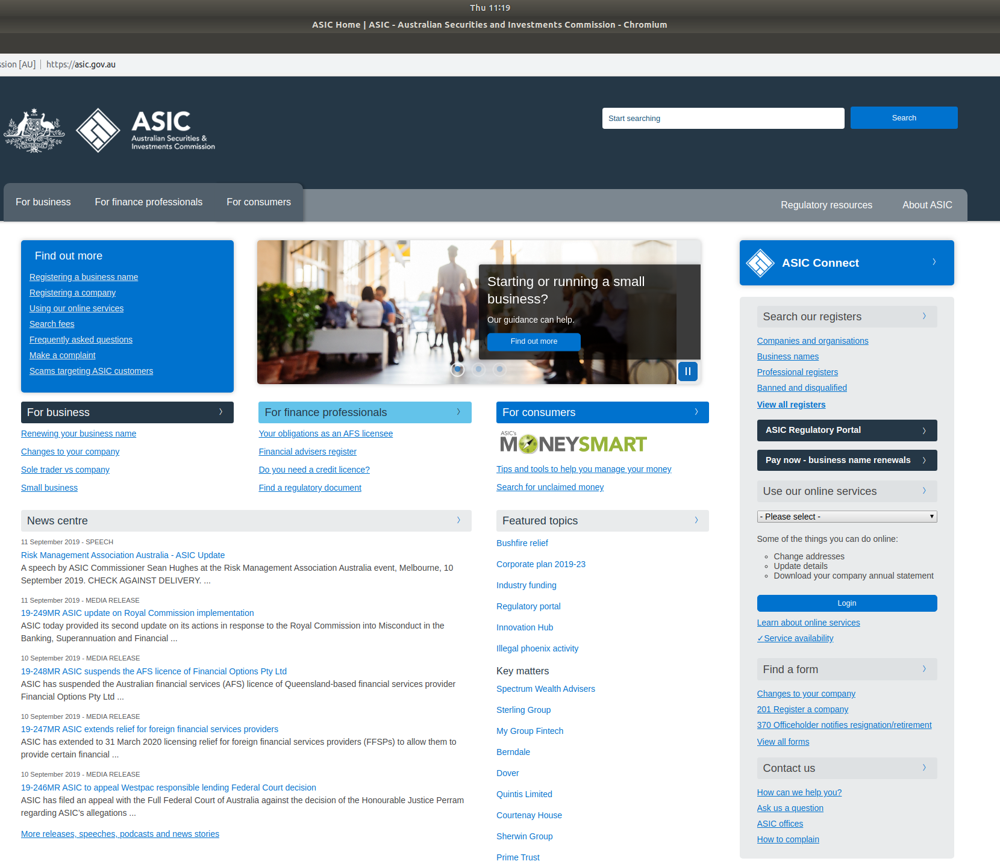
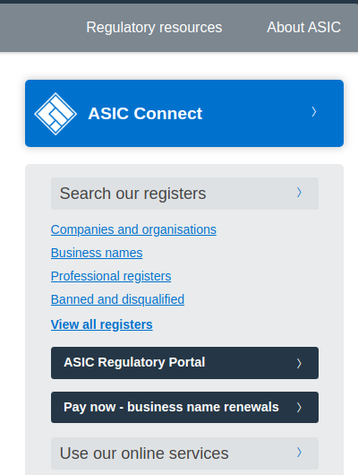
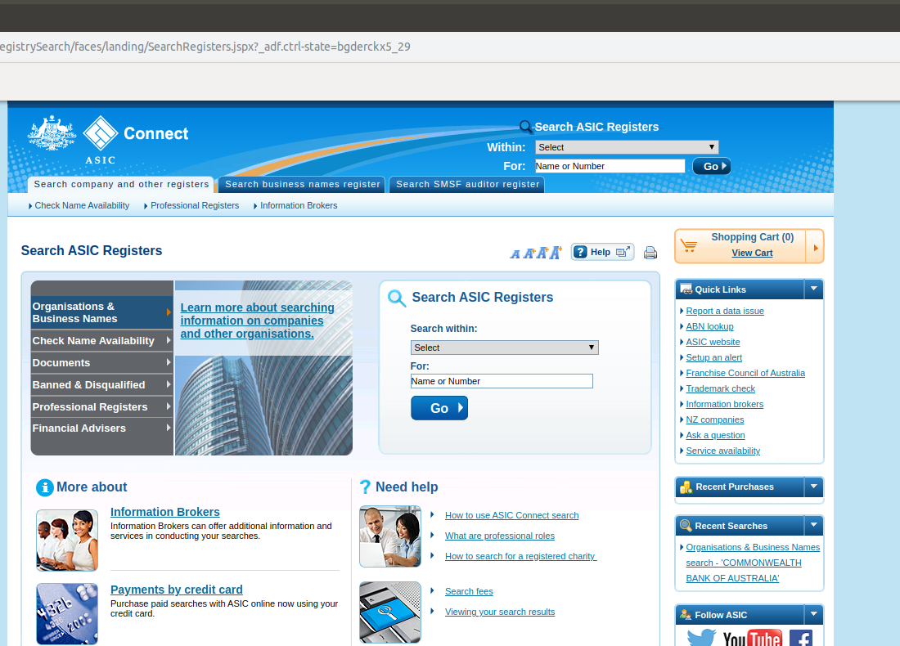
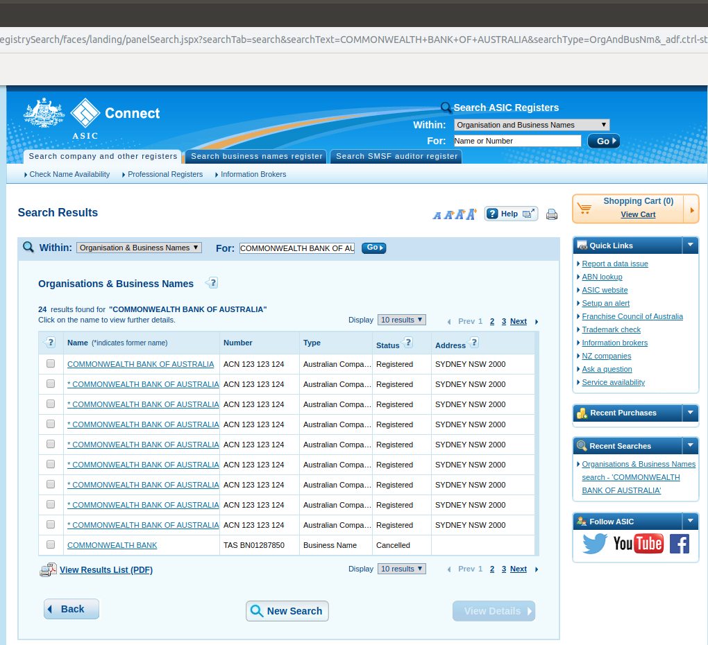
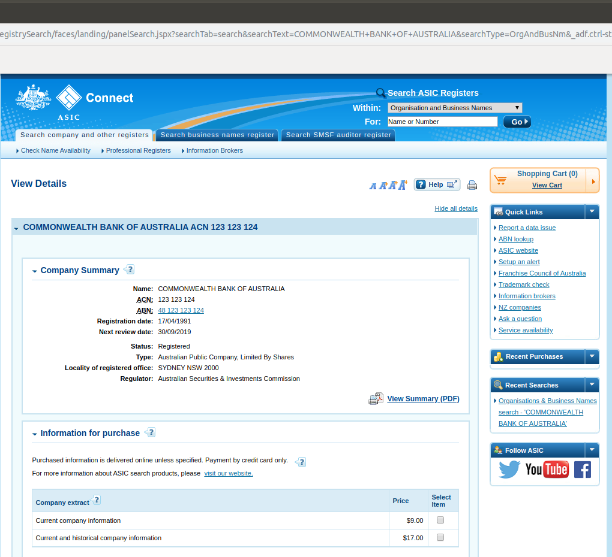
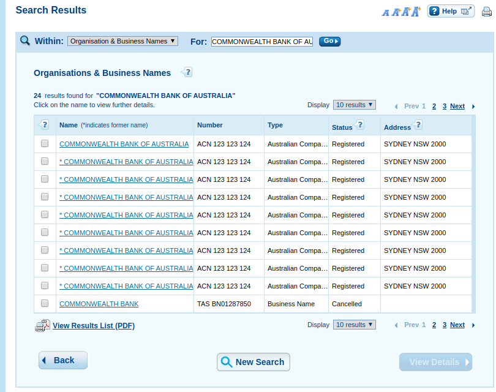
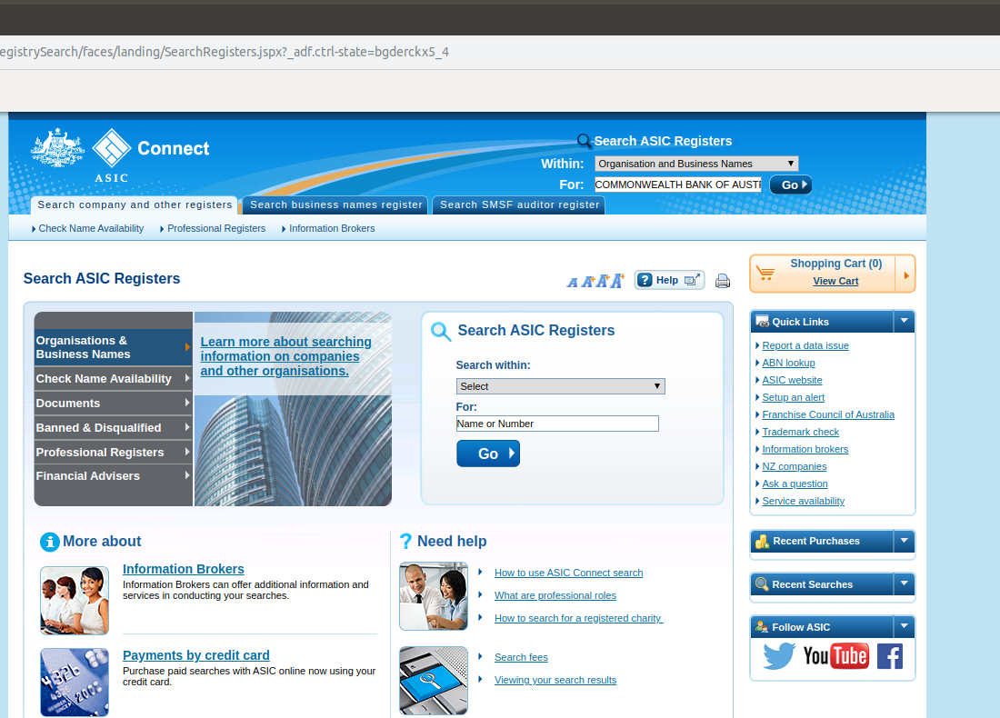
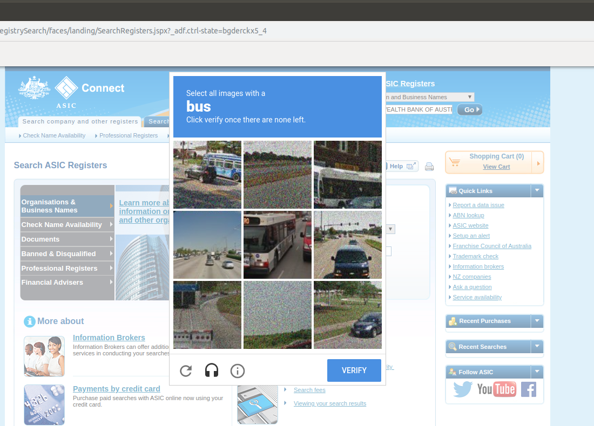

# asx

This README gives a detailed description of the table `asic.asx`. This table gives the current information that exists on the ASIC database on each unique entity that has been listed on the ASX, that is each entity that has ever been assigned an `issuer_id` in the `asxlisting` tables. 
 

## The table and fields
 
 - `linked_id`: the minimum `issuer_id` which identifies the firm. Same as the `issuer_id` in `asxlisting.filings`.
 
 - `company_name`: the current name of the entity, as given by the ASX. This was found by taking the `company_name` associated with the maximum `issuer_id` (from `asxlisting.issuer_ids`) ever assigned to each firm.
 
 - `company_name_asic`: the literal name recorded as a string of the entity given on the ASIC database. This is not always equal or even equivalent to `company_name` recorded from the ASX, as there are often issues with making a match, as will be explained below. If there are no matches for a firm on the ASIC database, this field is null.
 
 - `acn`: The ACN (Australian Company Number) assigned to the entity by ASIC, if applicable. This field is null if the entity does not have an ACN. 
 
 - `abn`: The ABN (Australian Business Number) assigned to the entity by the ATO, if ASIC has this information in its database. Note there are cases where an entity may have an ABN, but ASIC does not have it recorded in its database (this often happens with trusts and managed investment schemes, where ASIC, if it has information, usually just has a records of the ARSN, but not the ABN). If this is the case, or the entity does not have an ABN, this field is null.
 
 - `arbn`: The ARBN (Australian Registered Body Number) assigned to the entity by ASIC, if applicable. Usually foreign companies have this number instead of an ACN. This field is null if the entity does not have an ARBN.
 
 - `arsn`: The ARSN (Australian Registered Scheme Number) assigned to the entity by ASIC, if applicable. This number is typically associated with trusts and managed investment schemes. This field is null if the entity does not have an ARSN. 
 
 - `former_names`: A list of former names of the entity, used prior to its current name as given by `company_name_asic`. 
 
 - `previous_state_number`: The identifier previously assigned to the entity by the state in which the entity was previously registered. 
 
 - `previous_state_of_registration`: The state in which the entity was previously registered. 
 
 - `registration_date`: The date the entity was registered with ASIC.
 
 - `next_review_date`: The next review date for the entity.
 
 - `status`: The current registration status of the entity with ASIC (eg. 'Registered', 'Deregistered', and so on).
 
 - `date_deregistered`: The date of deregistration, if the entity has been deregistered with ASIC.
 
 - `type`: The type of entity, as registered by ASIC, (eg. 'Australian Public Company, Limited By Shares', 'Australian Public Company, No Liability', 'Managed Investment Scheme, etc.)
 
 - `locality_of_registered_office`: The city/town/suburb, state and postcode of the head office of the entity, given as a string, if applicable.
 
 - `regulator`: The regulator of the entity.
 
 - `registration_number`: An alternative field used by ASIC for `previous_state_number`. Not used very often.
 
 - `state_of_registration`: An alternative field used by ASIC for `previous_state_of_registration`. Not used very often.
 

 As mentioned in the basic description of the fields, there are a number of issues in matching records between entities listed on the ASX and records on the ASIC database. Firstly, this table was constructed semi-manually, as ASIC's online business name register uses a googlebot to instantiate a reCAPTCHA, which consists of a series of problems solved by recognizing images, when the bot detects a user who is potentially using an automated web browser. So the reCAPTCHA was done manually, and then each page corresponding to the desired records were scraped and written to the table in the `crsp` database. 
 
 Secondly, there are often inconsistencies between the respective names given on the ASX and on ASIC with regards to what should otherwise be matching records. There are a number of subissues here, which can be summarized by the following:
 
  1. Some linked_ids are associated with firms/entities that have been delisted from the ASX, but either exist or have existed for some time later as registered companies with ASIC, often with a different current name (ie. `company_name_asic`). In these cases, the `company_name` from the ASX can be mapped to some entry from `former_names`. If the entity is relatively recent, an entity with `company_name` being `SOME COMPANY NAME` will have an entry of the form `* SOME COMPANY NAME` in the search results page when the appropriate search is done on the ASIC website. For entities that have been deregistered for some time, the corresponding string with the asterix will often not appear in the search results, but the `company_name` will often have a good match for some entry in the `former_names` section. 
  
  2. Some companies with a given `linked_id` for which the `company_name` on the ASX is of the form `COMPANY NAME LIMITED` often only have meaningful matches to an entry with a `company_name_asic` of the form `COMPANY NAME LTD.`, and vice versa. For this reason, the function which determines whether two names match, `company_name_comparer(company_name_1, company_name_2)`, was designed to first strip the full stops from the appropriate strings (ie. 'LTD.' is considered equivalent to 'LTD', 'N.L.' is equivalent to 'NL', and so on), and to consider 'LIMITED' equivalent to 'LTD', 'PROPRIETARY LIMITED' to 'PTY LTD', 'NO LIABILITY' to 'NL', and so on. 
  
  3. There are many entities with a given `linked_id` and `company_name` that are in reality a group of several subentities, each with their own `abn`, `acn`, `arbn` and/or `arsn`. A large majority of these entities have `company_name`s ending in `GROUP` (eg. `WESTFIELD GROUP`, `linked_id = 5425`) These entities cannot be matched to records in ASIC by `company_name` alone. For these cases, the company numbers for the individual entities involved in the group were first searched from filings in `asxlisting.filings` which have headlines of the form `Appendix [0-9]+[A-Z]+` (eg. `Appendix 3B`, a very common filing associated with the issue of securities), as these filings normally have one of two boxes on the initial filing page containing the ABNs, ACNs, ARBNs and ARSNs. Then a record in `asic.asx` with the same given `linked_id` and `company_name` was made for each subentity searched on ASIC by the corresponding company number found. As a finished example, for `WESTFIELD GROUP`, a filing which contains company numbers for the subentities is the one with `ids_id` equal to [1455114](https://www.asx.com.au/asxpdf/20131021/pdf/42k51mnhw6wlwn.pdf), which is an Appendix 3E. A simple look at the `Name of Entity` box on the first page of the official ASX part of the form (or the footer on the first page made by Westfield Group) gives company numbers for the corresponding entries in `asic.asx` below
  
```
crsp=> SELECT linked_id, company_name, company_name_asic, former_names, abn,
crsp-> acn, arbn, arsn FROM asic.asx
crsp-> WHERE linked_id = 5425;
 linked_id |  company_name   |          company_name_asic           |                        former_names                         |      abn       |     acn     | arbn |    arsn     
-----------+-----------------+--------------------------------------+-------------------------------------------------------------+----------------+-------------+------+-------------
      5425 | WESTFIELD GROUP | SCENTRE GROUP LIMITED                | {"WESTFIELD HOLDINGS LIMITED"}                              | 66 001 671 496 | 001 671 496 |      | 
      5425 | WESTFIELD GROUP | SCENTRE MANAGEMENT LIMITED           | {"WESTFIELD MANAGEMENT LIMITED","WESTFIELD P.T.M. LIMITED"} | 41 001 670 579 | 001 670 579 |      | 
      5425 | WESTFIELD GROUP | SCENTRE GROUP TRUST 1                | {"WESTFIELD TRUST"}                                         |                |             |      | 090 849 746
      5425 | WESTFIELD GROUP | WESTFIELD AMERICA MANAGEMENT LIMITED |                                                             | 66 072 780 619 | 072 780 619 |      | 
      5425 | WESTFIELD GROUP | WESTFIELD AMERICA TRUST              |                                                             |                |             |      | 092 058 449
(5 rows)
```
 
  4. Some entities from the ASX have `company_name`s of the form `COMPANY NAME A (COMPANY NAME B)`. These entries on the ASX usually correspond to one or more managed investment schemes where one of the names, `A` or `B`, corresponds to the investment manager of each scheme, and the other name corresponds to the responsible entity of each scheme. For these cases, company numbers for these companies and each scheme were found from Product Disclosure Statements, which appear as filings in `asxlisting.filings`. In the `headline`s of these filings, an `mFund` code for the corresponding scheme normally appears, and the number of schemes to search for can be deduced by looking at how many distinct `mFund` codes appear in the headlines of all the filings in `asxlisting.filings` associated with the given `linked_id`. A row with the given `linked_id` and `company_name` was then made for the investment manager, the responsible entity, and each managed investment scheme by searching ASIC using the company numbers. As a finished example, for `ALPHINITY INVESTMENT MANAGEMENT (FIDANTE PARTNERS LIMITED)` (`linked_id = 16678`), there are three schemes `ALPHINITY AUSTRALIAN SHARE FUND` (with mFund code `ALH01`), `ALPHINITY CONCENTRATED AUSTRALIAN SHARE FUND` (mFund `ALH02`), and `ALPHINITY SUSTAINABLE SHARE FUND` (mFund `ALH03`). The filings with `ids_id` equal to [2118715](https://www.asx.com.au/asxpdf/20190628/pdf/4466yyth9yzdl3.pdf), [2118752](https://www.asx.com.au/asxpdf/20190628/pdf/446717ywgts488.pdf) and [2118722](https://www.asx.com.au/asxpdf/20190628/pdf/4466zdj4lqh7pk.pdf) correspond to Product Disclosure Statements for each of these schemes respectively, and these filings give the respective `arsn` for each scheme, as well as an `abn` for the investment manager, `ALPHINITY INVESTMENT MANAGEMENT PTY LTD`, and the responsible entity, `FIDANTE PARTNERS LIMITED`.
 
  
```
crsp=> SELECT linked_id, company_name, company_name_asic, abn, acn, arbn, arsn FROM asic.asx
WHERE linked_id = 16678;
 linked_id |                        company_name                        |              company_name_asic               |      abn       |     acn     | arbn |    arsn     
-----------+------------------------------------------------------------+----------------------------------------------+----------------+-------------+------+-------------
     16678 | ALPHINITY INVESTMENT MANAGEMENT (FIDANTE PARTNERS LIMITED) | ALPHINITY INVESTMENT MANAGEMENT PTY LTD      | 12 140 833 709 | 140 833 709 |      | 
     16678 | ALPHINITY INVESTMENT MANAGEMENT (FIDANTE PARTNERS LIMITED) | FIDANTE PARTNERS LIMITED                     | 94 002 835 592 | 002 835 592 |      | 
     16678 | ALPHINITY INVESTMENT MANAGEMENT (FIDANTE PARTNERS LIMITED) | ALPHINITY AUSTRALIAN SHARE FUND              |                |             |      | 092 999 301
     16678 | ALPHINITY INVESTMENT MANAGEMENT (FIDANTE PARTNERS LIMITED) | ALPHINITY CONCENTRATED AUSTRALIAN SHARE FUND |                |             |      | 089 715 659
     16678 | ALPHINITY INVESTMENT MANAGEMENT (FIDANTE PARTNERS LIMITED) | ALPHINITY SUSTAINABLE SHARE FUND             |                |             |      | 093 245 124
(5 rows)
```

  5. There are some cases which actually correspond to entities listed on a different stock exchange, usually the National Stock Exchange of Australia, for which `company_name` is of the form `NSX - COMPANY NAME`,  or the SIM Venture Securities Exchange (now the IR Plus Securities Exchange), for which the `company_name` is of the form `SIM - COMPANY NAME`. For these cases, the `company_name` was matched to a `company_name_asic` by doing the search with the `(NSX|SIM) - ` stem removed. 
  
  6. Some ASX listed entities with a given `company_name` have more than one match on an ASIC search. This was a problem, as the function used to find a match was designed only to return the first match, as most cases had at most one obvious match, and searching each search entry is time consuming. For these cases, the automated web browser was watched as the search was being made, and then backtracked manually to see if there were any other entries with a matching name, but different ACN. If there was another such entry, the search result was clicked on, and another row was made for this result in `asic.asx`. Eventually, it would be desirable to use the filings (such as Appendix 3B), to validate the correct match for each `linked_id`, and to correspondingly delete the incorrect matches. 
  
  7. The ASX sometimes replaces common words with certain acronyms when the `company_name` is very long, such as `FND` for `FUND`, `MGMT` for `MANAGEMENT`. As the number of these cases was small, they were usually done manually, by clicking a search result, or using the filings. Also, the choice was made to not have `company_name_comparer` handle all these cases, as there is the possibility a company could legitimately just contain these shortened strings as part of its name, and it was not desirable to introduce erroneous matches due to this. 
  
  
  8. There is sometimes the odd spelling mistake in `company_name`, or a different number of dots, apostrophes compared to the results in the ASIC search, as well as some unhelpful characters such as `"`. These small number of cases were usually done manually, either from the initial search or by doing a search using a company number from the filings. 
 
  9. There are cases where the `linked_id` corresponds to an entity which should clearly have no match on ASIC with a legitimate ACN, ARBN, ABN or ARSN, such as warrants (eg. `CURRENCY WARRANT AUS/USD`, `linked_id = 7208` ), current or former public sector entities such as the `STATE BANK OF VICTORIA` (`linked_id = 1444`), very old managed investment schemes (particularly those prior to 2001) such as the `AUSTRALIAN HEALTHCARE INVESTMENT FUND` (`linked_id = 18`), foreign stock exchange indices (eg. `NIKKEI 225 STOCK INDEX`, `linked_id = 3982`), or very old foreign companies (eg. `THE NEW ZEALAND GUARDIAN TRUST COMPANY LIMITED`, `linked_id = 3894`). Most of these cases have all the ASIC related fields, particularly `company_name_asic`, equal to null, while some cases have a match with no company number listed by ASIC (eg. `THE NEW ZEALAND GUARDIAN TRUST COMPANY LIMITED`). Some of these latter entries correspond to an foreign investment manager not registered with ASIC, and have been included for the sake of completeness (eg. the entry with `company_name_asic` equal to ` INSIGHT INVESTMENT MANAGEMENT (GLOBAL) LIMITED`, for `linked_id = 16008`).
  
  10. For some entities, `company_name` takes the form `COMPANY NAME (THE)`, but the appropriate `company_name_asic` takes the form `THE COMPANY NAME`, and vice versa. The function `company_name_comparer` was designed to consider these forms equivalent, thus making the correct match. 
  

## The code

 The code used to scrape the information from ASIC are contained in the file `scrape_abn_acn_from_asic.py`. This file just contains functions, and doesn't have a main program. The first step was to import a number of required functions and packages from the `selenium` package into a Jupyter Notebook, and to open a non-headless Selenium Chrome browser by doing
 ```python
from selenium import webdriver
from selenium.webdriver.chrome.options import Options
from selenium.webdriver.support.select import Select
from selenium.webdriver.common.by import By
from selenium.webdriver.support.ui import WebDriverWait
from selenium.webdriver.support import expected_conditions as EC
 
driver = webdriver.Chrome()
```
 
The last line in the above code simply opens a browser with no initial page. Then 
 
### `go_to_search_page(driver)`
 This function directs the browser to the ASIC connect search page. It takes as an argument the Selenium `driver` object, and returns `True` if it has successfully directed it to the search page. It works by first making `driver` do a get request to `asic.gov.au`, seen in the screenshot directly below





and then it gets the tag associated with the `Companies and organisations` hyperlink in the subsection in this image 





leading to the ASIC Connect search page in the next screenshot





### `enter_company_search(driver, company_name)`

 After the browser has been opened and directed to the ASIC Connect page, this function takes in the browser (`driver`) and a `company_name`, and performs a search by the `company_name`. It does this by searching for the tags associated with the dropdown and input text boxes, as well as the `Go` button associated with the section of any ASIC Connect page (opening page, search page or result page) shown in the image below, then it enters `Organisation and Business Names` for the dropdown box, `company_name` for the input text box, and then clicks the `Go` button.


If this is successful, the browser will go to a search results page for the `company_name`, like the one shown below





### `company_name_comparer(company_name_1, company_name_2)`

This functions takes in two company names as strings, and decides if they are equivalent. This is used under the hood in functions described below to find good matches in the ASIC search results for a given `company_name` from the ASX. The code for this function is shown below. 


```python
def company_name_comparer(company_name_1, company_name_2):
    
    company_name_1 = company_name_1.upper()
    company_name_2 = company_name_2.upper()
    
    # First, strip annoying, troublesome dots, and any annoying spaces on sides. 
    # And get rid of '* ' from the left, so that past company names on ASIC search
    # are treated the same to compared name either way. Also, make sure both upper case
    company_name_1 = company_name_1.replace('* ', '').lstrip(' ').rstrip(' ').replace('\.', '')
    company_name_2 = company_name_2.replace('* ', '').lstrip(' ').rstrip(' ').replace('\.', '')
    
    if(re.search("\(THE\)", company_name_1)):
        company_name_1 = "THE " + re.sub("\(THE\)", "", company_name_1)
        
    if(re.search("\(THE\)", company_name_2)):
        company_name_2 = "THE " + re.sub("\(THE\)", "", company_name_2)

    # next in both names, replace 'LIMITED' with 'LTD', 'PROPRIETARY LIMITED' with 'PTY LTD' and so on
    
    company_name_1 = re.sub('(PROPRIETARY)', 'PTY', re.sub('(LIMITED)', 'LTD', company_name_1))
    company_name_2 = re.sub('(PROPRIETARY)', 'PTY', re.sub('(LIMITED)', 'LTD', company_name_2))
                            
    # Also replace N.L (or N.L.) with just NL
    
    company_name_1 = re.sub('(NOT LIMITED|NON LIMITED|NO LIMITED|NO LIABILITY)', 'NL', company_name_1)
    company_name_2 = re.sub('(NOT LIMITED|NON LIMITED|NO LIMITED|NO LIABILITY)', 'NL', company_name_2)

    # Finally, try AND with &
    company_name_1 = re.sub(' AND ', ' & ', company_name_1)
    company_name_2 = re.sub(' AND ', ' & ', company_name_2)
    
    if(company_name_1 == company_name_2):
        return(True)
        
    else:
        return(False)
```

Here, we see that it handles a few of the name matching issues mentioned above, particularly problems 2 and 10.


### `get_company_info_table(driver)`

If we click on one of the search results in type of page which `enter_company_search` leads the browser to (typically in some function that has found a match using `company_name_comparer`), the browser will go to a results page that looks like the one below





Assuming we are on a page like this, `get_company_info_table` takes the browser object as an argument, then scrapes the data in the `Company Summary` section, which is the interesting section that typically contains the ABNs, ACNS and so on, and then returns the data as a dataframe. 


### `search_results_and_extract_info(driver, company_name)`

If the browser is lead to a typical search page, with a table like the one in the screenshot below, this function firstly gets the tags associated with the hyperlinks for the search results, and then initially uses `company_name_comparer` to compare the associated names to `company_name` in order to find a match. If this fails, it traverses iteratively over the search results, uses `get_company_info_table` to scrape on the data on a result momentarily, and then uses `company_name_comparer` to compare the names in the `former_names` field to `company_name`, and if there is a match, it breaks the loop and returns this dataframe from the result that has just been visited. If there is still no match, it returns `None`.




 
### `get_most_relevant_match_df(driver, company_name)`

This function takes the browser object and `company_name`, and if the browser is on a typical search page like the one shown previously, it first determines the number of search result pages, and then it uses `search_results_and_extract_info` iteratively over the search pages, starting with the first page, and using the `Next` hyperlink to progres to the next page. If it finds a match on some search page, it breaks the loop and returns the dataframe produced by `search_results_and_extract_info`. If it has passed over all search pages, and `search_results_and_extract_info` has produced `None` each time, then no match has been found, and the function returns `None`. 


### `extract_asic_details(driver, linked_id, company_name)`

This function takes the browser object, `linked_id`, and the associated `company_name`, and first performs a search using `enter_company_search`. If the browser is directed straight to a result page, which happens when the ASIC Connect page produces only one possible search result, it uses `get_company_info_table` to scrape the data from the result into a dataframe `raw_df`, then it uses `company_name_comparer` to compare `company_name` to the `company_name_asic` of `raw_df`, and keeps the data in `raw_df` if it's a match. If it's not a match, `raw_df` is reset to `None`. Also, if the browser is directed to a page in which the string `0 results found for` appears (ie. no results for the `company_name`), it sets `raw_df` to `None`. Otherwise, in the typical case, the browser is lead to a search page like the one previously mentioned above, and then this function uses `get_most_relevant_match_df` to get the data, and stores the result in `raw_df`. 

After `raw_df` is found, this function uses the code 
```python
df = pd.DataFrame({'linked_id': [linked_id], 'company_name': [company_name]})
df = pd.concat([df, raw_df], axis = 1)
```
then it iterates over the columns, setting a column to a `datetime` format if the column corresponds to a date, and then finally returns `df` as the result. Note that second line in the above snippet of code still actually works (ie. doesn't raise an error) even if `raw_df` is `None`, in which case `df` maintains its initial value set in the first line. This is important, since `linked_id` and `company_name` are the ASX-associated fields, when `df` is later written to the database in the cases where `raw_df` is `None`, the resulting entries will have the ASIC-associated fields set to `NULL`, which is convenient as in these cases, no match has been found.


### `write_asic_details(driver, engine, linked_id, company_name)`

This function `extract_asic_details` to get the appropriate dataframe for the `linked_id` and `company_name`, and writes it to the database, in the table `asic.asx`, returning `True` if successful. Otherwise, `False` is returned if there is some failure. Also, in the former case, this function iterates over the dataframe columns, and makes a new column if a particular column does not currently exist in the table.


## The data scraping process

 Now that we have described the main scraping functions in the previous section, we can discuss the general process for using them to scrape the data. Ultimately, we wish to link ABNs, ACNs, ARBNs and/or ARSNs to `linked_id`s, which are the lowest `issuer_id`s associated with each distinct entity, by conducting searches by the current name of each entity. The code below does the required SQL query and imports its result into the dataframe `max_id_company_names_df`. 


```python
sql_alt = """
          WITH max_ids AS (SELECT MAX(issuer_id) AS issuer_id, linked_id 
          FROM asxlisting.issuer_id_link GROUP BY linked_id)
          SELECT a.issuer_id, max_ids.linked_id, a.company_name FROM asxlisting.issuer_ids AS a
          INNER JOIN max_ids
          USING (issuer_id)
          LEFT JOIN asic.asx AS b
          USING(linked_id)
          WHERE b.linked_id IS NULL
          ORDER BY linked_id
          """      

max_id_company_names_df = pd.read_sql(sql, engine)
```

Here, the current names are found by finding the maximum, and thus current, `issuer_id`s for each `linked_id`, represented by the temporary table `max_ids`, then inner joining `max_ids` with `asxlisting.issuer_ids`. Finally, a left join is done with `asic.asx` and selecting the cases where the `b.linked_id` value associated with `asic.asx` is `NULL`, thus obtaining the the `linked_id`s which have not been processed into `asic.asx`. If the table is empty, we get the entire set of distinct `linked_id`s in the associated column of `max_id_company_names_df`.

Next, we open a Selenium Chrome browser object (which we usually store in a variable called `driver`), like we did in the previous section, and then use `go_to_search_page` to go to the ASIC Connect page. As one can guess, scraping the data from this point involves repeated calling `write_asic_details` for each `(linked_id, company_name)` pair contained in `max_id_company_names_df`. When we first use the function, the search is entered (here we use the example `COMMONWEALTH BANK OF AUSTRALIA`), as can be seen here





but when the function clicks the `Go` button, a version 3 reCaptcha is instantiated, as can be seen in the next screenshot





It is this problem which made making a fully automated process for capturing this data difficult. Hence, the decision was made to do complete reCaptcha manually, and then use `write_asic_details` as many times as possible until the reCaptcha was re-instantiated. For this reason, `enter_company_search`, which `write_asic_details` is using under the hood to do the searches, was designed to do a Selenium Wait command after clicking the `Go` button, which made the browser wait until a certain tag on the resulting search page appeared, which could only happen on the first occasion if the reCaptcha was done before the wait timed out. The timeout for the wait command was set at 10 minutes, to give plenty of time to complete the reCaptcha. Normally, it was possible to use `write_asic_details` about 20 times consecutively each time reCaptcha was done, before the reCaptcha reappeared. 

Given the many issues that appeared with the name matching, the full set of `linked_id`s was passed through on a couple of rounds. In the first round, the entire set (around 6740 ids, at the time) was ensentially passed through, with the browser being watched minimally to look out for multiple distinct matches (problem 2) and the odd cases of unhelpful characters and acronyms (problems 7 and 8). The around 80-85% of cases which had an appropriate match were picked up relatively quickly by `write_asic_details`, in that they had unique match accessed by the browser. 

After the first pass through the full set, a second pass was done for the entries which either had `company_name_asic` equal to `NULL`, or all of the `abn`, `acn`, `arbn` and `arsn` fields set to `NULL`. This amounted to around 1000 cases after the first pass. This second pass actually took longer to do, as this constituted the difficult cases, and the browser was watched much more closely. It was in this step that the filings, such as Appendix 3B, were checked for company numbers, particularly for groups (problem 5) and managed investment schemes with a given investment manager and responsible entity (problem 6). If a result had to be accessed manually, either by clicking on a later result in the search results which the browser had not accessed, or doing a search by company number, the result was manually written to `asic.asx` was done using the following commands in three separate Jupyter Notebook cells: firstly, `get_company_info_table`
```python
raw_df = get_company_info_table(driver)
raw_df
```
was used to get the raw result, and the result was printed for checking, then information on the associated `(linked_id, company_name)` was added, and date columns changed to datetime format, using
```python
df = pd.DataFrame({'linked_id': [max_id_company_names_df.loc[i, 'linked_id']], \
                   'company_name': [max_id_company_names_df.loc[i, 'company_name']]})

df = pd.concat([df, raw_df], axis = 1)


for col in df.columns:

    if(re.search('(^date_|_date$|_date_)', col) is not None):
        df[col] = pd.to_datetime(df[col], format = "%d/%m/%Y")
    
df
```
with the corresponding `df` also being checked, and then finally `df` was written to the database using
```python
types = {'linked_id': st.Integer(),
         'company_name': st.Text(),
         'company_name_asic': st.Text(),
         'acn': st.Text(),
         'abn': st.Text(),
         'previous_state_number': st.Text(),
         'previous_state_of_registration': st.Text(),
         'registration_date': st.Date(),
         'next_review_date': st.Date(),
         'status': st.Text(),
         'type': st.Text(),
         'locality_of_registered_office': st.Text(),
         'regulator': st.Text(),
         'former_names': st.ARRAY(st.Text(), dimensions = 1),
         'date_deregistered': st.Date(),
         'arbn': st.Text()
         }

df.to_sql('asx', engine, schema="asic", if_exists="append", 
            index=False, dtype = types)
```
 

After the second pass, the cases which still had either no match, or all the company number fields being `NULL`, were comprehensively determined to have no good match on ASIC. A good list of these is given in point 9 of the summary of the name matching problems. 

Now that the bulk of the `linked_id`s have been processed, it is relatively simple to keep the table up to date. As new issuer_ids are added, and new entities listed on the ASX, these can be matched to company numbers on ASIC by using the same process above as they are added to the issuer_id tables. 


 
 
 

